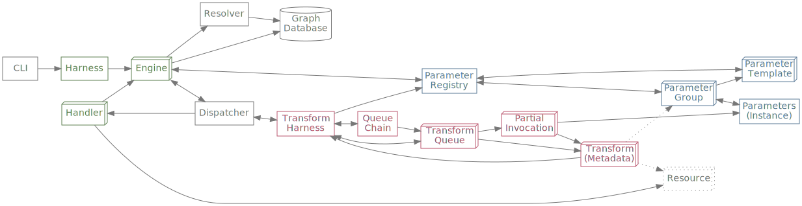

# Intertwingler — An Engine for Dense Hypermedia

`Intertwingler` is an _engine_, very much like
[WordPress](https://www.wordpress.org/) is an engine: you use it to
make websites. You can think of `Intertwingler`, at least _this_
implementation of it, as a _demonstrator_ for the kind of
infrastructure necessary to make the Web do genuine _dense
hypermedia_.

The way to understand _dense_ hypermedia is to contrast it with what
the Web is off the shelf, which is _sparse_ hypermedia: big clunky
_pages_ with not a lot of links, and what links _do_ exist are
sequestered into regions like navigations and other UI. What we want
instead are smaller, more _composable_ units, the mechanism of
composition being — what will end up being a much greater density of —
ordinary links. The effect we are after with `Intertwingler` is to
_pulverize_ Web content, dramatically increasing its _addressability_.
Not only does this afford practical benefits like content reuse, but
new affordances for software tools and creative expression.

# Strategy

The main problem `Intertwingler` has to solve, then, is the fact that
links on the Web are extremely _brittle_. The reason _why_ links on
the Web are brittle is because it's very cheap to change the URL of a
Web resource, and very _expensive_ to change all the places where that
URL is _referenced_. `Intertwingler` solves this problem the following
way:

* It stores _links_ (i.e., referent-reference pairs✱) as first-class objects,
* It assigns every resource a [canonical
  identifier](#canonical-identifiers) that doesn't budge,
* It _overlays_ human-friendly address components (slugs) on top,
* It _remembers_ prior values for these address components if you change them,
* It uses a custom _resolver_ to do everything in its power to match a
  requested URL to _exactly one_ resource,
* It also has a mechanism for the principled handling _parametrized_
  and _derived resources_, maintaining a registry of parameter names,
  syntaxes, semantics, and other metadata.

`Intertwingler` accomplishes all this by bringing your organization's
entire address space (i.e., every Web URL under every domain you control)
under its management.

> ✱ Actually, `Intertwingler` stores links as _triples_ where the
> third element is the kind of link it is. More on this later.

Also packaged with the `Intertwingler` demonstrator are the means for
creating websites with dense hypermedia characteristics:

* A file system handler, for transition from legacy configurations
* A [content-addressable
  store](https://en.wikipedia.org/wiki/Content-addressable_storage)
  handler, for bulk storage and caching of [opaque resources](#opaque-resource)
* A pluggable markup generation handler, for rendering [transparent
  resources](#transparent-resource)
* Mutation handlers (e.g. `PUT` and `POST`) for both opaque and
  transparent resources,
* A set of [transforms](#transform) for manipulating resource
  [representations](#representation), specifically HTML/XML markup and
  images.

# Architecture


## Concepts

This is a brief glossary of terms that are significant to
`Intertwingler`. It is not exhaustive, as it is assumed that the
reader is familiar with Web development terminology. Note that I will
typically prefer the more generic term "URI" (identifier) rather than
"URL" (locator), and use "HTTP" to refer to both HTTP and HTTPS unless
the situation demands more precision.

### (Information) Resource

An information resource is a _relation_ between one or more
_identifiers_ (in this case URIs) and one or more _representations_. A
familiar type of information resource is a _file_, which has exactly
one representation and usually one, but possibly more than one
identifier (file name/path). Web resources have an additional
dimension, which is the _request method_ or _verb_ with which the
resource was requested.

#### Opaque Resource

An _opaque_ resource is named such because the enclosing information
system does not need to "see into" it. An opaque resource _may_ have
more than one representation, but one representation will always be
designated as canonical.

#### Transparent Resource

A _transparent_ resource is the complement of an opaque resource: the
enclosing information system can, and often _must_, "see into" its
structure and semantics. Since the canonical representation of a
transparent resource resides only in live working memory, all
serializations (that neither discard information nor make it up) are
considered equivalent.

### Representation

A representation (of an information resource on the Web) is a literal
sequence of bytes (octets) that represents the given information
resource. Representations can vary by media type, natural language,
character set, compression, and potentially many other dimensions.

### HTTP Transaction

An HTTP(S) transaction refers to the process of a client issuing a
single request to a server, and that server responding in kind. In
other words, a single request-response pair.

### Handler

An `Intertwingler` handler is a microservice with certain
characteristics. All handlers are designed to be run as stand-alone
units for bench testing and system segmentation. A handler responds to
at least one request method for at least one URI. Handlers have a
_manifest_ that lists the URIs, request methods, parameters, content
types, etc. under their control. This enables the `Intertwingler`
engine to perform preemptive input sanitation, and efficiently route
requests to the correct handler.

### Engine

The `Intertwingler` _engine_ is a special-purpose handler that
marshals all other handlers and transforms, resolves URIs, and routes
requests to handlers. This is the part that faces the external network.

### Transform

A _transform_ is a special-purpose handler that encapsulates one or
more operations (each identified by URI) over a request body. As such,
transforms only respond to `POST` requests. Like all handlers,
transforms have lists of content types for each URI in their manifest
that they will both accept and emit. Transforms are configured to run
in a queue, with the output of one being fed into the input of the
next. Through its interaction with an HTTP message, a transform may
also trigger a _subsequent_ transform to be added to its own, or
another queue.

#### Request Transform

A _request_ transform operates over HTTP requests. It can modify the
request's method, URI, headers, body (if present), or any
combination thereof.

#### Response Transform

A _response_ transform operates over HTTP responses. Analogous to
request transforms, response transforms can manipulate the response
status, headers, body, or any combination thereof. _Unlike_ a request
transform, there are multiple queues for response transforms: an
early-run queue and a late-run queue, with an _addressable_ queue
sandwiched between them.

## Handlers

Everything in `Intertwingler` is a handler, including the engine
itself. At root, a handler is a _microservice_ created in compliance
with the host language's lightweight Web server interface ([in our
case with Ruby](#implementation-note), [that would be
Rack](https://github.com/rack/rack)).

A handler is intended to be only interfaced with using HTTP (or,
again, the Web server interface's approximation of it). That is, a
handler instance is a callable object that accepts a request object
and returns a response object. A handler is expected to contain at
least one URI that will respond to at least one request method.

## The `Intertwingler` Harness and Engine(s)

The `Intertwingler` harness imagines itself one day turned into a
high-performance, stand-alone reverse proxy, with hot-pluggable
handlers (and by extension, transforms) that can be written in any
language, and interface internally over HTTP. That is the lens with
which to view the design. The harness is meant to be put at the edge
of an organization's Web infrastructure and manage the Web address
space, with an engine assigned to each of the organization's (DNS)
domains.

> When an HTTP transaction occurs completely within an engine's
> process space (i.e., it does not try to access handlers running in
> other processes/engines), the engine has strategies to mitigate the
> amount of extraneous parsing and serialization that would otherwise
> occur.

### Interactions Between Engine Components



> This diagram attempts to show how the parts of the Intertwingler
> engine's anatomy interact with each other. Solid lines represent
> that one instance (the base) has the other instance (the arrowhead)
> as a member. Bidirectional arrows signify a backreference. Dotted
> arrows are ephemeral links, e.g. URIs. 3D boxes represent
> (potentially) multiple instances. Green boxes are handlers or
> subclasses thereof. (Transform handlers are undifferentiated from
> ordinary handlers in this view.)

## `Intertwingler` Handler Manifests (In Progress)

Still in progress at the time of this writing is a finalized design
for handler _manifests_, though some details are certain. A manifest
is intended to advertise the set of URIs that a given handler will
respond to, along with:

* what request methods are recognized,
* what content types are available as a response,
* what URI query parameters are recognized, their data types,
  cardinality, etc.,
* what content types are accepted in requests (at least the ones that
  send body content)
* in the case of `POST`ed HTML forms
  (`application/x-www-form-urlencoded` and `multipart/form-data`
  types), parameter lists analogous to query parameters,
* etc…

The exact format of the manifest payload is still yet to be
determined. What is _known_ is that handler manifests will be
retrieved by the special `OPTIONS *` request, intended to address the
server (in this case microservice) directly rather than any one
particular resource it manages. Since the [HTTP
specification](https://datatracker.ietf.org/doc/html/rfc9110#section-9.3.7)
does not explicitly define semantics for any content in response to
`OPTIONS *`, we future-proof by only sending the manifest if a
[`Prefer:
return=representation`](https://datatracker.ietf.org/doc/html/rfc7240#section-4.2)
header is present in the request, in addition to the ordinary content
negotiation headers, `Accept` and so on.

## State

`Intertwingler` maintains its state — at least the [transparent
resources](#transparent-resource) — in an RDF graph database. The
current implementation uses a very simple, locally-attached quad
store. [Opaque resources](#opaque-resource), or rather their literal
representations, are held primarily in a content-addressable
store. `Intertwingler` also includes a file system handler to help
transition from legacy configurations.

> Both the graph database and the content-addressable store are
> candidates for stand-alone systems that could be scaled up and out.

## Addressing

`Intertwingler` maintains URI continuity by ascribing durable
[canonical identifiers](#canonical-identifiers) to every resource, and
then _overlaying_ human-friendly yet potentially perishable
identifiers on top. The goal of the `Intertwingler` resolver is to
eliminate the possibility of a user receiving a `404` error, at least
in practice. (In principle it will always be possible to request URIs
that `Intertwingler` has never had under its management.)

While it is possible, for aesthetic reasons, to ascribe an explicit
path as an overlay URI, Intertwingler only needs as much path
information as is necessary to match exactly _one_ canonical
identifier. That is, if the database only contains one resource with a
slug of `my-summer-vacation`, then the full URI
`https://my.website/my-summer-vacation` is enough to positively
identify it. (If a longer path was explicitly specified, then
`Intertwingler` will redirect.) If a _second_ resource shows up in the
graph with the same slug, `Intertwingler` will return `300 Multiple
Choices` with the shortest URIs that will unambiguously identify both
options.

URI path segments prior than the terminating one correspond to
arbitrary entities in the graph that happen to have been appropriately
tagged. Again, the only purpose they serve is to unambiguously
identify the terminating path segment. For the path `/A/B/C/d` to
resolve, `A` has to exist and be connected (again, arbitrarily) to
`B`, `B` to `C`, and `C` to `d`. If only _part_ of the path resolves,
then _that_ is one of the few situations you will encounter a `404` —
because the path is _over_\specified — something you can only do if
you enter the path manually, as `Intertwingler` will only ever expose
(explicit overrides notwithstanding) the shortest uniquely-identifying
overlay path for any resource. As such, if `d` can be uniquely
identified using a shorter path, the default behaviour of
`Intertwingler` is to redirect.

> In practice, this behaviour subsumes what we ordinarily think of as
> "folders" or "containers", and will be possible to configure which
> resource and relation types get considered for "container-ness", but
> in general `Intertwingler` does not recognize the concept of a
> container as a category of entity that is meaningfully distinct from
> a non-container.

### Canonical Identifiers

`Intertwingler` uses
[UUIDs](https://datatracker.ietf.org/doc/html/rfc4122) for the bulk of
its canonical identifiers, with the exception of those that correspond
1:1 to byte segments (that is to say, the opaquest of the opaque),
which use [URIs derived from cryptographic
digests](https://datatracker.ietf.org/doc/html/rfc6920). The former
can always be reached by accessing, e.g.:

    https://my.website/d3e20207-1ab0-4e65-a03c-2580baab25bc

and the latter, e.g.:

    https://my.website/.well-known/ni/sha-256/jq-0Y8RhxWwGp_G_jZqQ0NE5Zlz6MxK3Qcx02fTSfgk

…per [RFC6920](https://datatracker.ietf.org/doc/html/rfc6920). If the
resolver finds a suitable overlay address for the UUID form, it will
redirect, but the hash URI form remains as-is. Direct requests to
these hash URIs (at least from the outside) will also bypass any
response transforms, in order to preserve the cryptographic
relationship between the URI and the representation.

## `Intertwingler` Transform Protocol

The transform protocol is inspired by [the FastCGI
specification](https://fastcgi-archives.github.io/FastCGI_Specification.html#S6.3),
and its use in server modules like Apache's
[`mod_authnz_fcgi`](https://httpd.apache.org/docs/2.4/mod/mod_authnz_fcgi.html).
In this configuration, the main server issues a subrequest to a
FastCGI daemon, and then uses the response, in this case, to determine
if the outermost request is authorized. The reasoning goes that this
behaviour can be generalized to ordinary HTTP (in our era of reverse
proxies, FastCGI is an extra step), as well as handle other concerns
in addition to authorization. (Indeed, FastCGI itself [also specifies
a _filter_
role](https://fastcgi-archives.github.io/FastCGI_Specification.html#S6.4),
but I have not seen a server module that can take advantage of it.)

A direct request to a transform looks like a `POST` to the transform's
URI where the request body is the object to be transformed. Additional
parameters can be fed into the transform using the URI's query
component, it being on a separate band from the request body. `POST`s
to transforms _must_ include a `Content-Type` header and _should_
include an `Accept:` header to tell the transform what it prefers as a
response. The `Content-Length`, `Content-Type`, `Content-Language`,
and `Content-Encoding` headers of the transform's response will be
automatically merged into the original HTTP message.

### Entire-Message Transforms

Transforms can modify the entire HTTP message by serializing the
message (or the part desired to be modified) into the body of the
request to the transform, and using the content type `message/http`.
Transforms that accept serialized HTTP messages as request bodies
should respond in kind.

> That is, if you were writing an entire-request-manipulating
> _request_ transform, it would expect the `POST`ed content to be a
> serialized _request_, and would likewise _return_ a serialized
> request. An analogous _response_ transform would expect a serialized
> _response_ in the request body, and likewise respond with a
> serialized _response_, all `message/http`.

For entire-message-manipulating transforms, it is only necessary to
pass in the part of the HTTP message that one wishes to have
transformed, plus any additional information needed for the
transformation to be successful. (It is, however, necessary to include
the request line or status line, for request transforms and response
transforms, respectively.) Results will be merged into the original
HTTP message. Responding with an identical value as the request
(request line, status line, or header) will leave it unchanged, or in
the case of headers, it is safe to omit them. To signal that a header
ought to be deleted, include it in the outgoing header set with the
empty string for a value.

### URI Rewriting and No-Ops

The response codes `303 See Other` and `304 Not Modified` have special
meaning with respect to transforms. If a _request_ transform returns a
`303`, its `Location` header should be interpreted as a simple
internal rewrite of the request-URI. A `304` indicates that the
transform (request _or_ response) has made no changes at all. All
other `3XX` responses are forwarded to the client.

> Redirect responses from _addressable_ response transforms that
> return their own URI path with different _query_ parameter values
> are translated backwards into the outermost request with different
> _path_ parameter values.

### Addressable Transforms

Most transforms are configured statically, but some response
transforms are addressable through the use of _path parameters_, a
lesser-known feature of URIs. The advantage of using path parameters
to identify response transforms is that they stack lexically, so the example:

    https://my.website/some/image;crop=200,100,1200,900;scale=640,480

…would fetch `/some/image` from a content handler, and then in a
subrequest, `POST` the resulting response body to, say,
`/transform/crop?x=200&y=100&width=1200&height=900`, receive _that_
response body, and then `POST` _it_ to
`/transform/scale?width=640&height=480`, the response to which would
be reattached to the outgoing response to the client. The mapping that
relates the comma-separated positional arguments in the path
parameters to key-value query parameters is expressed using the
[Transformation Functions Ontology](#transformation-functions-ontology).

## Handler Inventory

Everything in `Intertwingler` is a handler, but the undecorated term
"handler" refers to content handlers. These are the stripped-down
microservices that actually respond to outside requests.

### File System Handler

This is a rudimentary handler that provides content-negotiated `GET`
support to one or more document roots on the local file system.

### Markup Generation Handler

This handler generates
(X)HTML+[RDFa](https://www.w3.org/TR/rdfa-primer/) (or other markup)
documents from subjects in the graph. Pluggable sub-handlers can be
attached to different URIs or RDF classes.

#### Generic Markup Generation Sub-Handler

This creates a simple (X)HTML document with embedded RDFa intended for
subsequente manipulation downstream. This sub-handler and others will
eventually be supplanted by a hot-configurable
[Loupe](https://vocab.methodandstructure.com/loupe#) handler.

#### Atom Feed Sub-Handler

This will map resources typed with certain RDF classes to Atom feeds
when the request's content preference is for `application/atom+xml`.

#### Google Site Map Sub-Handler

This will generate a Google site map at the designated address.

#### `skos:ConceptScheme` Sub-Handler

This is a special alphabetized list handler for
[SKOS](https://www.w3.org/TR/skos-primer/) concept schemes.

#### `sioct:ReadingList` Sub-Handler

This is a special alphabetized list handler for bibliographies.

#### Person/Organization List Sub-Handler

This is a special alphabetized list handler for people, groups, and
organizations.

#### All Classes Sub-Handler

This handler will generate a list of all RDF/OWL classes known to
`Intertwingler`. Useful for composing into interactive interfaces.

#### Adjacent Property Sub-Handler

This handler will generate a resource containing a list of RDF
properties that are in the domain of the subject's RDF type(s).
Useful for composing into interactive interfaces.

#### Adjacent Class Sub-Handler

This handler will generate a resource containing a list of subjects
with `?s rdf:type ?Class .` statements where `?Class` is in the range
of a given property. Useful for composing into interactive interfaces.

### Content-Addressable Store Handler

The content-addressable store handler wraps
[`Store::Digest::HTTP`](https://github.com/doriantaylor/rb-store-digest-http)
(which itself wraps
[`Store::Digest`](https://github.com/doriantaylor/rb-store-digest)).
This handler maps everything under `/.well-known/ni/`. You can add a
new object to the store by `POST`ing it to that address.
`Store::Digest::HTTP` also generates rudimentary index pages.

### Reverse Proxy Handler (TODO)

While the plan is to include a reverse proxy handler, and while they
are relatively easy to write, I am leaving it out until I can
determine a sensible policy for not letting the entire internet access
the entire rest of the internet through the reverse proxy.

### Linked Data Patch Handler

The
[LD-Patch](https://dvcs.w3.org/hg/ldpwg/raw-file/ldpatch/ldpatch.html)
handler processes `PATCH` requests with `text/ldpatch` content and
applies them to the graph. This can be used in conjunction with the
[RDF-KV Transform](#rdf-kv-transform).

## Transform Inventory

Much of the labour of Web development is considerably simplified if
you realize that many of the operations that bulk up Web applications
can be construed as transformations over HTTP message bodies. Most
transforms don't need much, if _any_ information outside of the
segment of bytes they get as input. Most transforms, moreover, are
tiny pieces of code.

### Request Transforms

Again, request transforms are run in advance of the content handlers,
generally making small adjustments to headers and sometimes
manipulating request bodies.

#### Markdown Hook Transform

This simple transform adds `text/markdown` to the request's `Accept`
header, so downstream content negotiation selects Markdown variants
when it wouldn't otherwise. It also hooks the [Markdown to
HTML](#markdown-to-html-transform) response transform.

> Note that if the `Accept` header _already_ contains `text/markdown`
> with a higher score than `text/html` or `application/xhtml+xml`,
> the markdown passes through to the client untouched.

#### Sass Hook Transform

In a virtually identical move, this transform adds the
`text/x-vnd.sass` and `text/x-vnd.sass.scss` content types to the
request's `Accept` header, and hooks the [Sass Transform](#sass-transform).

#### Pseudo-File `PUT` Transform

This transform will take a `PUT` request to a particular URI and
generate the graph statements needed to fake up a file path, while
transforming the request into a `POST` to
[`/.well-known/ni/`](#content-addressable-store-handler) to store the
content.

> This is a basic mechanism for getting content onto the site in lieu
> of a fully-fledged [WebDAV](https://datatracker.ietf.org/doc/html/rfc4918)
> infrastructure, which will come later. I have implemented a WebDAV
> server before and it was an entire project unto itself.

#### RDF-KV Transform

This transform will take `POST` requests with
`application/x-www-form-urlencoded` or `multipart/form-data` bodies
that conform to the [RDF-KV protocol](https://doriantaylor.com/rdf-kv)
and transform the request into a `PATCH` with a `text/ldpatch` body,
suitable for the [LD-Patch handler](#linked-data-patch-handler).

### Response Transforms

Response transforms are run _after_ the selected content handler, in
three phases: _early-run_, _addressable_, and _late-run_.
Theoretically any response transform can be run in any phase, but some
transforms will only make sense to run in certain phases, and/or
before or after other transforms in the same phase.

#### Markdown to HTML Transform

This transform will take Markdown and turn it into (X)HTML.

#### Sass Transform

This transform will take [Sass](https://sass-lang.org/) content and
turn it into CSS.

#### Tidy Transform

This transform will run [HTML Tidy](https://www.html-tidy.org/) over
(X)HTML content.

#### RDF Transform

Turn an RDFa document into Turtle, N-Triples, RDF/XML, or
[JSON-LD](https://json-ld.org/).

> Also turn any of those types into each other.

#### Strip Comments Transform

Removes the comments from HTML/XML markup.

#### (X)HTML Conversion Transform

Transforms HTML to XHTML and vice versa.

#### Rewrite `<head>` Transform

Ensures the correct `<title>` and `<base href="…">` elements are
present in an (X)HTML document, as well as `<link>`, `<meta>`,
`<script>` and `<style>`.

#### Rehydrate Transform

Transforms certain inline elements in an (X)HTML document (`<dfn>`,
`<abbr>`…) into links to term definitions, people, places, companies…

#### Add Social Media Metadata Transform

Adds [Google](https://schema.org/), [Facebook](https://ogp.me/),
[Twitter](https://developer.twitter.com/en/docs/twitter-for-websites/cards/overview/abouts-cards),
etc. metadata to the `<head>` of an (X)HTML document.

#### Add Backlinks Transform

Adds a chunk of markup containing backlinks to every block or section
element in an (X)HTML document that is an identifiable RDF subject.

#### Rewrite Links Transform

Rewrites all links embedded in a markup document to the most up-to-date URIs.

#### Mangle `mailto:` Transform

Obfuscates e-mail addresses/links in a manner serviceable to recovery
by client-side scripting.

#### Add Amazon Tag Transform

Adds an affiliate tag to Amazon links.

#### Normalize RDFa Prefixes Transform

Moves RDFa prefix declarations to the root (or otherwise outermost
available) node where possible; overwrites alternate prefix
identifiers with those configured in the resolver; prunes out unused
prefix declarations.

#### Add `xml-stylesheet` PI Transform

This transform will add an `<?xml-stylesheet …?>` processing
instruction to the top of an XML document, for use with XSLT or CSS.

#### Apply XSLT Transform

Applies an XSLT stylesheet to an XML document.

#### Reindent Transform

Normalizes the indentation of an HTML/XML document.

#### Image Conversion Transform

Converts a raster image from one format to another.

#### Crop Transform

Crops an image.

#### Scale Transform

Scales an image down.

#### Desaturate Transform

Makes an image black and white.

#### Posterize Transform

Posterizes an image.

#### Knockout Transform

Generates a transparency mask based on a colour value.

#### Brightness Transform

Manipulates an image's brightness.

#### Contrast Transform

Manipulates an image's contrast.

#### Gamma Transform

Manipulates an image's gamma value.

## Implementation Notes

Parts of `Intertwingler`, notably the URI resolver and markup
generation handlers, depend on a
[reasoner](https://en.wikipedia.org/wiki/Reasoner) to make inferences
about assertions in the database. In 2018, when I began working on
`Intertwingler`'s predecessor, `RDF::SAK`, the only workable
implementations of reasoners were in Java and Ruby (which still
appears to more or less be the case). I chose Ruby because it was
easier for prototyping. My vision for `Intertwingler`, though, is that
it eventually has implementations in as many languages as it can.

# Installation

For now I recommend just running the library out of its source tree:

```bash
~$ git clone git@github.com/doriantaylor/rb-intertwingler.git intertwingler
~$ cd intertwingler
~/intertwingler$ bundle install
```

# Configuration

`Intertwingler` is effectively a form of middleware, meaning it's effectively useless without mounds of content.  Until further notice, my recommendation is to monitor the [Getting Started](CONFIGURATION.md) guide.

# Sponsorship

The bulk of the overhaul that transformed `RDF::SAK` into
`Intertwingler` was funded through a generous research fellowship by
the [Ethereum Foundation](https://ethereum.foundation/), through their
inaugural [Summer of Protocols](https://summerofprotocols.com/)
program. This was a unique opportunity for which I am sincerely
grateful. I would also like to thank [Polyneme
LLC](https://polyneme.xyz/) for their financial support and ongoing
interest in the project.

# Contributing

Bug reports and pull requests are welcome at
[the GitHub repository](https://github.com/doriantaylor/rb-intertwingler).

# Copyright & License

©2018-2023 [Dorian Taylor](https://doriantaylor.com/)

This software is provided under
the [Apache License, 2.0](https://www.apache.org/licenses/LICENSE-2.0).
